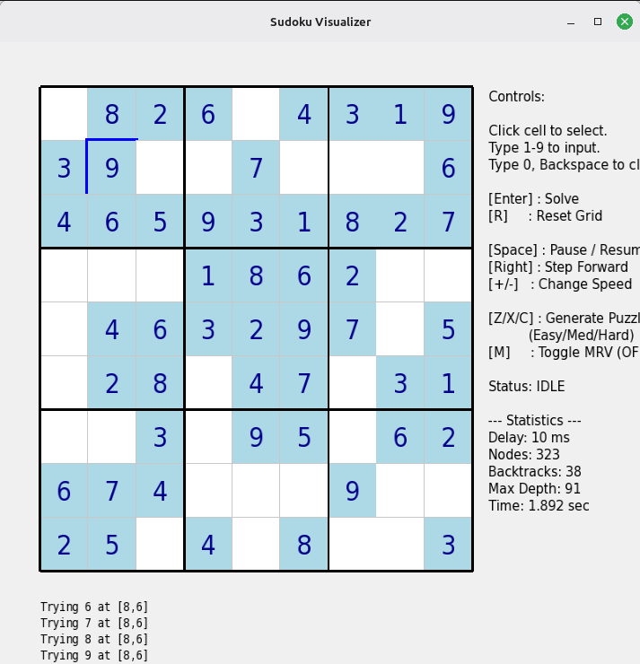
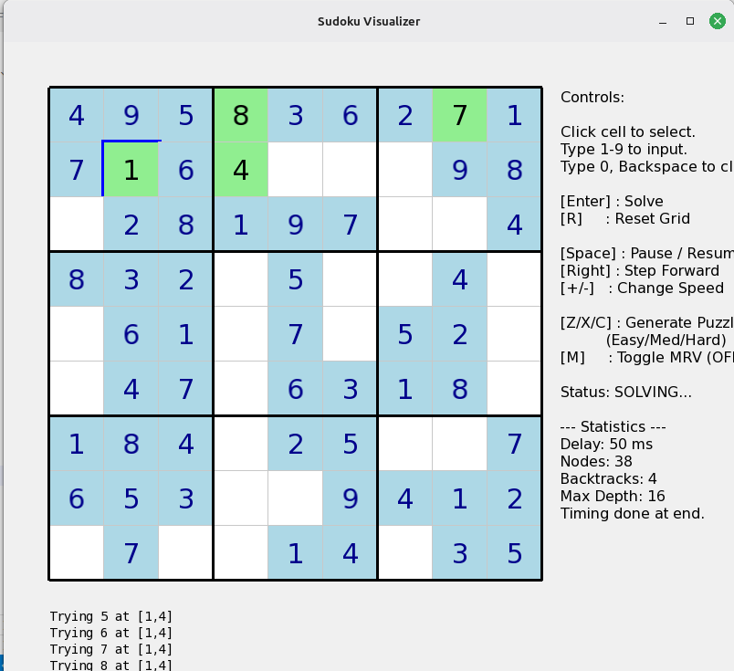

# Sudoku Visualizer

A responsive, graphical Sudoku solver and visualizer built natively in C++ using SFML (Simple and Fast Multimedia Library). Features include dynamic puzzle generation (Easy/Medium/Hard), manual numerical entry with conflict notifications, algorithm state visualizations (Backtracking vs. MRV heuristic), and precise timing loops.

### Visualizations




---

## 🛠 Prerequisites & Dependencies

The project uses `CMake` and its `FetchContent` system, meaning **you do NOT need to download SFML manually**. CMake will retrieve the SFML repository during build time automatically!

However, depending on your Operating System, you will need native C++ build tools correctly installed.

### 🐧 Installing Requirements on Linux (Ubuntu/Debian)
SFML relies on native Linux desktop libraries like X11, OpenGL, and Freetype. Before building, install the GCC compiler and graphical dependencies:
```bash
# Update repositories
sudo apt update 

# Install CMake and C++ compiler tools
sudo apt install -y cmake build-essential

# Install SFML UI development headers
sudo apt install -y libx11-dev libxrandr-dev libxcursor-dev libudev-dev \
    libgl1-mesa-dev libfreetype-dev libopenal-dev libflac-dev libvorbis-dev \
    libxinerama-dev libxi-dev
```

### 🪟 Installing Requirements on Windows
1. Install [CMake](https://cmake.org/download/) and ensure it is added to your System PATH during installation.
2. Install a C++ Compiler: 
    * Use **Visual Studio** (Install the "Desktop development with C++" workload).
    * *Or* install **MinGW-w64** if you prefer GCC setups.

---

## 🚀 Building the Project

Whether you are on Windows or Linux, the build process via CLI is identical. Open your Terminal/Command Prompt in the project's root directory:

```bash
# Option 1: Using CMake command line (Recommended)
cmake -B build
cmake --build build

# Option 2: Using Make natively (Linux)
mkdir build && cd build
cmake ..
make
```

### 🏃 Running the Application

- **Linux**: Executable is generated in your build directory.
  ```bash
  ./build/SudokuVisualizer
  ```
- **Windows**: Executable is placed in the build directory. Depending on your generator (e.g., Visual Studio adds Debug/Release folders), it will typically be:
  ```cmd
  build\Debug\SudokuVisualizer.exe
  ```
  *(Note that during Windows builds, CMake is configured to automatically copy any required DLLs to the executable directory to ensure seamless booting).*

---

## 💡 Addressing the Font Issue (Cross-Platform)

Historically, C++/SFML projects crash natively if they attempt to load an absolute path to a system font that does not exist. 

**This has been heavily combated in this source code and should no longer be an issue!**
The internal classes (`Application.cpp` and `EventLogger.cpp`) are chained with `||` OR logic which universally handles both Operating Systems.
1. The code attempts to load `C:\Windows\Fonts\arial.ttf` directly.
2. If that fails securely (e.g., you are actively using Linux), it triggers a fallback and grabs `/usr/share/fonts/truetype/dejavu/DejaVuSans.ttf`.
3. If both of those fail, it will check the current local working directory for an `arial.ttf` file.

**If you still see a Black Screen or a "Failed to load Font" error:**
Place any valid `.ttf` file locally inside the active run-directory of the executable and rename it to `arial.ttf`. The app will inherently consume it as a final fallback and recover.
